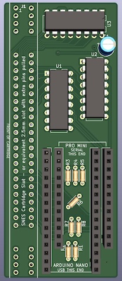

SNESDump Board
==============

A board for use with [https://github.com/cthill/SNESDump].

It is designed completely with through-hole components because that's what most people have lying
around.

The routing is _ugly_ because I wanted the board to be compatible with the original code without any
changes.

 

## Bill of Materials

* Cartridge Slot (1)
  - The cartridge slot can be either
    * A scavenged slot from a real SNES or Super-Famicom
    * A compatible 2.5mm 70-pin slot can be used with the appropriate pins yanked out
      - This slot *MUST* be 2.5mm pitch (so-called "metric spacing") and not the more common 2.54mm
    pitch (0.1 inches)

* Resistors (8)
  - Any 10K resistors will work as long as they can physically fit

* Shift Registers (3)
  - Any through-hole 74HC595N or compatible will work
  - Use of DIP sockets is recommended to make troubleshooting easier

* Arduino/Microcontroller
  - You can use either an Arduino Nano or Arduino Pro Micro (or clones thereof) in the indicated
    footprint
  - For obvious reasons you can't use both at the same time
  - It is **highly** recommended to mount the microcontroller on headers so it can be removed later

## Licenses

SNES Slot Footprint ([SNES-CONN-EXP.kicad_mod](https://github.com/db-electronics/kicadlib)) is
distributed under the terms of CERN OHL v.1.2.

Arduino Pro Mini symbol and footprint (used as reference, not in final board output) is from
[SnapEDA](https://www.snapeda.com/parts/Arduino%20Pro%20Mini/Arduino/view-part/) and distributed
under [their license](footprints/SnapEDA+License.txt).

Unless otherwise specified, all other content herein is (C) 2022 Matthew Nielsen and is distributed
under the terms of [CC BY-NC-SA 4.0](https://creativecommons.org/licenses/by-nc-sa/4.0/).

### Sale of this board is NOT ALLOWED

I'm annoyed that I need to write this, but I do:

> ❗ ANY SALE OF THIS DESIGN IS STRICTLY PROHIBITED UNLESS AUTHORIZED IN WRITING BY RIGHTS HOLDER
>
> You **ARE ALLOWED** to make copies of this board for your __personal__ use, __give__ them to your
> friends, hand them out __for free__ to strangers on the street, or any other purpose so long as
> *you neither ask for nor receive payment* of any kind.
>
> You **ARE NOT ALLOWED** to make copies and sell them. Period. Whether you sell them for a profit
> or for a loss, it is not allowed. Whether you charge "for materials", "for time/labour", "for
> shipping and handling", it is not allowed.